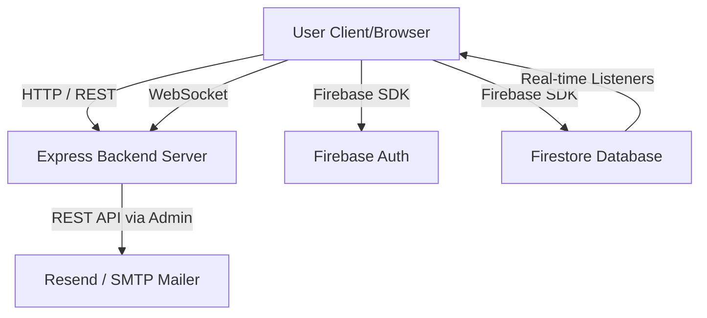

# Velocity Workspace

## Overview

Velocity is an enterprise-grade project and task management platform engineered for real-time collaboration. It provides structured workflows, instant state propagation across all connected clients, and stringent role-based access control. The application is designed for teams requiring high visibility, accountability, and seamless synchronization for their operational pipelines.

## Features

- **Real-Time Synchronization**: WebSockets combined with Firestore provide instantaneous state propagation for task movements, typing indicators, and presence updates.
- **Structured Workflows**: Kanban boards and detailed list views to manage tasks with priority, status, due dates, subtasks, and tags.
- **Role-Based Access Control (RBAC)**: Distinct member roles (Owner, Admin, Manager, Member, Viewer) dictating access privileges and operational boundaries within projects.
- **Authentication**: Secure email/password login, Google OAuth integration, and Guest mode support via Firebase Authentication.
- **Project Invitations**: Invite team members via direct email invitations (powered by Resend/SMTP) or secure shareable invite codes.
- **Activity Logging & Auditing**: Centralized audit trails tracking all major operations (task creation, assignment, movement, etc.).
- **Interactive UI/UX**: Sleek, formal, high-contrast light theme (Zinc/Blue) utilizing Tailwind CSS and smooth animations via `motion`.
- **Live Presence & Collaboration**: Real-time display of active users, typing indicators in comments, and live notifications.

## Tech Stack

| Layer            | Technology | Purpose |
| ---------------- | ---------- | ------- |
| Frontend         | React 19   | UI Library |
| Framework        | Vite 6     | Build Tool & Dev Server |
| Styling          | Tailwind CSS v4 | Utility-first styling & Design System |
| Backend          | Node.js / Express | API Routes & WebSocket Server |
| Database         | Firebase Firestore | Durable Cloud Document Persistence |
| Authentication   | Firebase Auth | User identity management (Email, Google, Guest) |
| State Management | React Context / Hooks | Local state & Auth/WebSocket state |
| Real-time Comm.  | `ws` (WebSockets) | Transient real-time events (Typing, Presence) |
| Mailing          | Resend / Nodemailer | Email delivery for project invitations |

## Architecture

Velocity utilizes a hybrid real-time architecture combining durable cloud storage with transient WebSocket channels.



- **Frontend**: A React SPA served by Express (in production) or Vite (in dev). It connects directly to Firebase for durable CRUD operations and listens to Firestore snapshot changes.
- **Backend**: An Express server primarily acting as a WebSocket hub to broadcast transient data (who is online, who is typing) and secure API endpoints for operations like sending emails.
- **Database**: Firestore handles the durable state (Tasks, Projects, Users, Comments, Invitations).

## Project Structure

```text
/
├── server.ts               # Express backend & WebSocket server entry point
├── package.json            # Dependencies and scripts
├── .env.example            # Environment variables template
├── firestore.rules         # Firebase database security rules
├── src/
│   ├── App.tsx             # Main React application & routing
│   ├── main.tsx            # React DOM rendering entry point
│   ├── index.css           # Global Tailwind CSS and scrollbar styling
│   ├── types.ts            # TypeScript interfaces (User, Task, Project, etc.)
│   ├── designSystem.tsx    # Reusable UI components (Buttons, Avatars, Inputs)
│   ├── firebase.ts         # Firebase initialization and config
│   ├── components/         # React Components
│   │   ├── AuthModal.tsx   # Authentication UI
│   │   ├── BoardView.tsx   # Kanban board layout
│   │   ├── Header.tsx      # Main application navigation
│   │   ├── TaskCard.tsx    # Individual task display
│   │   └── ...
│   ├── context/            # React Context Providers
│   │   ├── AuthContext.tsx # Authentication state
│   │   └── WebSocketContext.tsx # WebSocket connection & broadcasting
│   ├── services/           # External service integration
│   │   └── firestoreService.ts # Database CRUD wrappers
│   └── utils/              # Helper functions (sound effects, date formatting)
```

## Installation

1. Install dependencies:
   ```bash
   npm install
   ```

2. Set up Firebase:
   - Ensure you have a Firebase project with Firestore and Authentication enabled.
   - Copy `firebase-applet-config.example.json` to `firebase-applet-config.json` and fill in your Firebase project credentials.
   - (Note: `firebase-applet-config.json` is included in `.gitignore` to protect your API keys and project IDs).

3. Configure Environment Variables:
   - Copy `.env.example` to `.env` and fill in the required values (e.g., `RESEND_API_KEY`).

## Environment Variables

| Variable | Purpose | Required |
| -------- | ------- | -------- |
| `RESEND_API_KEY` | API Key for Resend email delivery (project invites) | Optional (Recommended) |
| `SMTP_*` | Fallback SMTP credentials if Resend is not used | Optional |

*Note: Firebase configuration is injected into the app context seamlessly via the deployment environment or `firebase-applet-config.json`.*

## Running the Project

**Development Mode:**
```bash
npm run dev
```
Starts the backend Express server with Vite middleware on port 3000.

**Production Build:**
```bash
npm run build
npm run start
```
Bundles the frontend and backend, serving the static React app through the Express server.

## API Documentation

| Method | Endpoint | Purpose | Authentication |
| ------ | -------- | ------- | -------------- |
| `GET`  | `/api/health` | Health check endpoint | None |
| `POST` | `/api/send-invitation` | Dispatches invitation emails to users | None (Internal verification) |
| `POST` | `/api/projects/:projectId/broadcast` | Triggers custom websocket broadcasts | None (Internal routing) |

## Database

**Technology:** Firebase Firestore (NoSQL Document Database)

**Main Collections:**
- `users`: User profiles, avatars, roles.
- `projects`: Project metadata, columns, and members mapping.
- `tasks`: Individual tasks, subtasks, assignees, due dates.
- `comments`: Discussion threads linked to tasks.
- `invitations`: Pending project invites with secure tokens.
- `activity_logs`: Historical audit trail of workspace actions.
- `notifications`: User-specific alert records.

## Authentication

Velocity uses **Firebase Authentication** handling:
- **Email/Password**: Standard registration and login flows.
- **Google OAuth**: Single Sign-On using Google accounts.
- **Guest Access**: Anonymous authentication for quick trial access.
- **Protected Routes**: The main workspace is shielded; unauthenticated users are redirected to the Landing Page.

## User Flow

1. **Discovery**: User visits the application and lands on the Landing Page.
2. **Authentication**: User signs up or logs in via the Auth Modal.
3. **Redirection**: User is automatically redirected to the Workspace Dashboard (`#workspace`).
4. **Project Creation**: User creates a new project, setting up basic Kanban columns.
5. **Team Assembly**: User navigates to Project Settings to generate an invite code or send an email invitation to colleagues.
6. **Task Management**: User creates tasks, assigns them, adds subtasks, and moves them across the board.
7. **Real-time Sync**: As the user drags a task or types a comment, WebSockets broadcast these events to all other active members in the project instantly.
8. **Logging out**: User logs out and is redirected securely back to the Landing Page.

## Project Status

**Status: Functional and Deployable**
The application is fully implemented, verified, and operational. All core features (Authentication, Real-time Sync, Database CRUD, Emailing) are functioning as designed.
